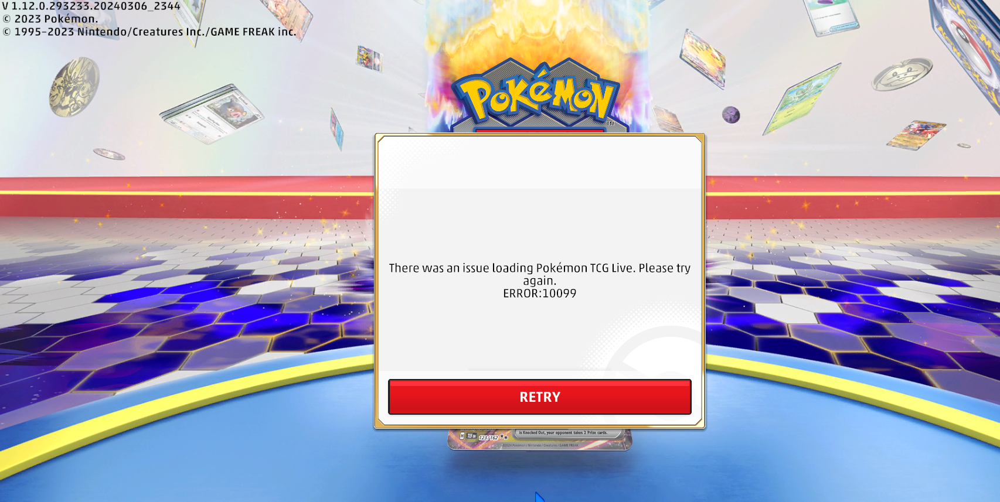
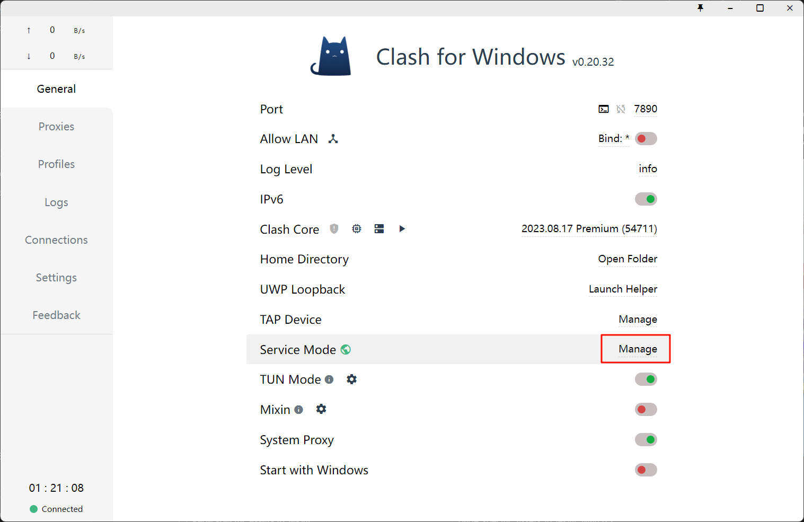
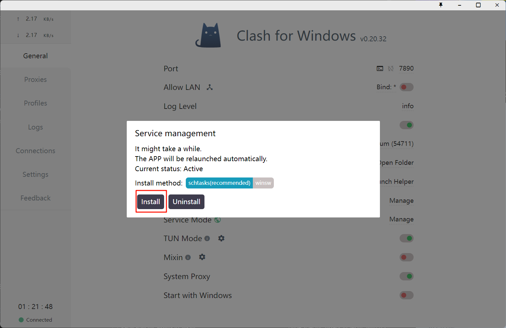
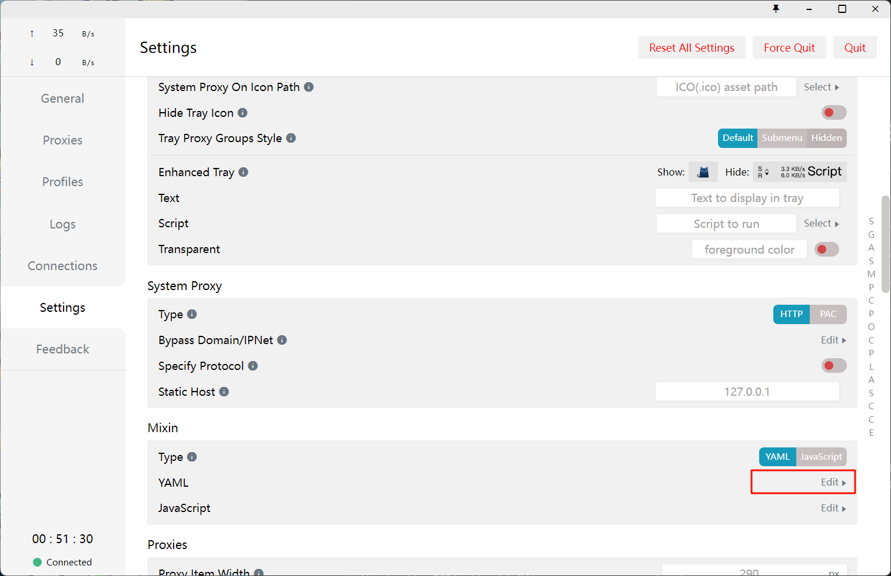
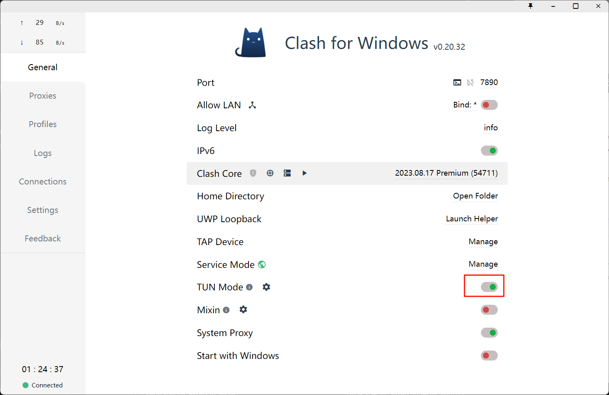
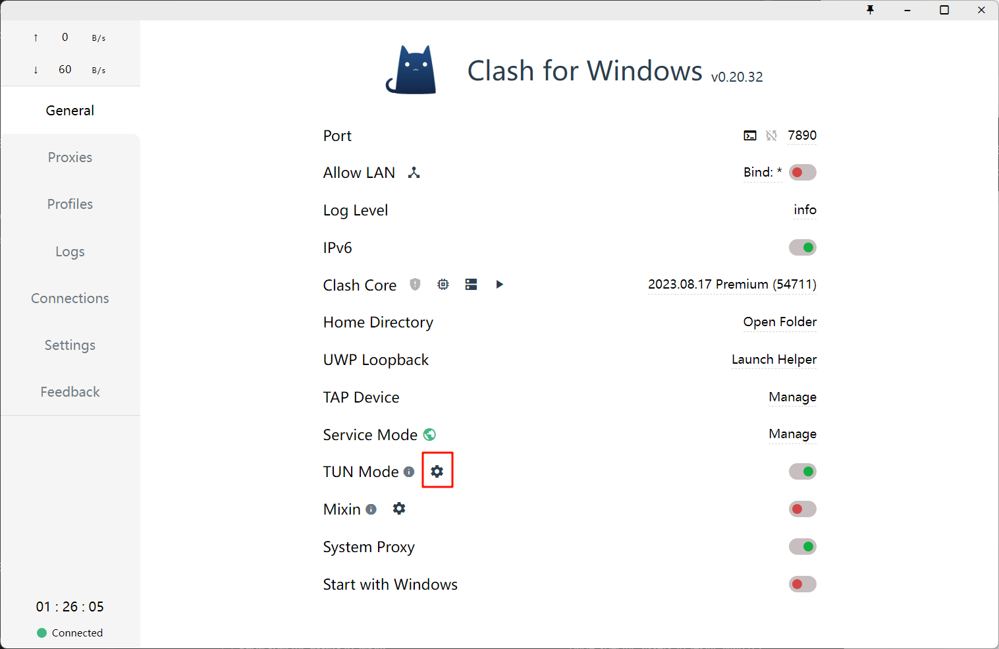
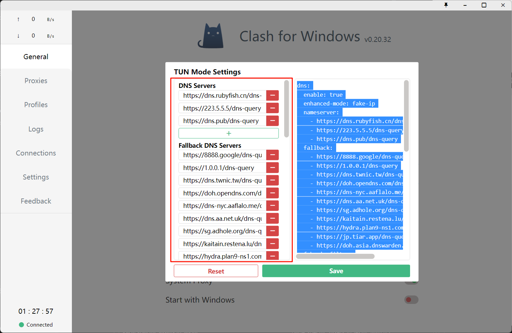
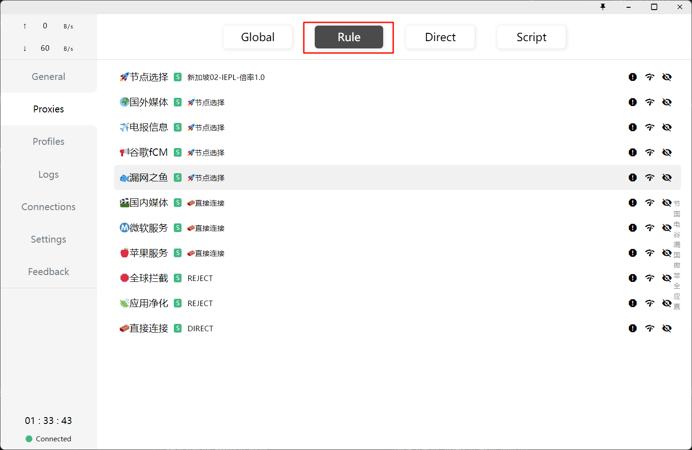

## 前言

之前玩Pokemon TCG Live （PTCGL）尝试用Clash for Windows （CFW）加速，发现无效，就改用其它游戏加速器了。所幸有两个加速器一直是免费的，例如[OurPlay加速器](https://www.ourplay.net/pc/)、OO网游加速器。近日群友表示Clash也能加速PTCGL，需要设置虚拟网卡，就搜搜资料折腾一下，发现打开TUN模式，就能加速PTCGL了。



## 步骤

### 第一步：安装Service Mode

1. 首页点击Service旁的 Manage



1. 点击弹窗中的Install



1. 等待Clash重启，会发现首页Service Mode旁的地球图标变绿了，表示安装成功



### 第二步：打开TUN Mode

1. 打开首页TUN Mode旁的开关



1. 如无意外，打开后就可以登录PTCGL了，如果发生了意外，可以参考我的TUN配置文件，点击TUN Mode旁的设置图标



1. 在弹窗左边添加地址配置



文本如下

```yaml
dns:
  enable: true
  enhanced-mode: fake-ip
  nameserver:
    - https://dns.rubyfish.cn/dns-query
    - https://223.5.5.5/dns-query
    - https://dns.pub/dns-query
  fallback:
    - https://8888.google/dns-query
    - https://1.0.0.1/dns-query
    - https://dns.twnic.tw/dns-query
    - https://doh.opendns.com/dns-query
    - https://dns-nyc.aaflalo.me/dns-query
    - https://dns.aa.net.uk/dns-query
    - https://sg.adhole.org/dns-query
    - https://kaitain.restena.lu/dns-query
    - https://hydra.plan9-ns1.com/dns-query
    - https://jp.tiar.app/dns-query
    - https://doh.asia.dnswarden.com/adblock
  fake-ip-filter:
    - +.stun.*.*
    - +.stun.*.*.*
    - +.stun.*.*.*.*
    - +.stun.*.*.*.*.*
    - "*.n.n.srv.nintendo.net"
    - +.stun.playstation.net
    - xbox.*.*.microsoft.com
    - "*.*.xboxlive.com"
    - "*.msftncsi.com"
    - "*.msftconnecttest.com"
    - WORKGROUP
    - +.google.com
    - +.facebook.com
    - +.twitter.com
    - +.youtube.com
    - +.xn--ngstr-lra8j.com
    - +.google.cn
    - +.googleapis.cn
    - +.gvt1.com
tun:
  enable: true
  stack: gvisor
  auto-route: true
  auto-detect-interface: true
  dns-hijack:
    - any:53
```

1. 如果还不行，试试切换梯子线路，我最近喜欢新加坡的。

## 总结

TUN Mode可以处理网络的3层数据包，包括IP包，所以就能达到在PC上加速PTCGL的效果。注意TUN Mode不需要打开全局规则就能加速PTCGL。



## 参考资料

[Clash for Windows教程：配置TUN/TAP虚拟网卡，Clash订阅持续更新 - 优质盒子 (uzbox.com)](https://uzbox.com/tech/clash-atp.html)

[Clash-tun模式配置指南 | RainChan的小博客](https://rainchan.win/2022/05/15/Clash-tun%E6%A8%A1%E5%BC%8F%E9%85%8D%E7%BD%AE%E6%8C%87%E5%8D%97/)
